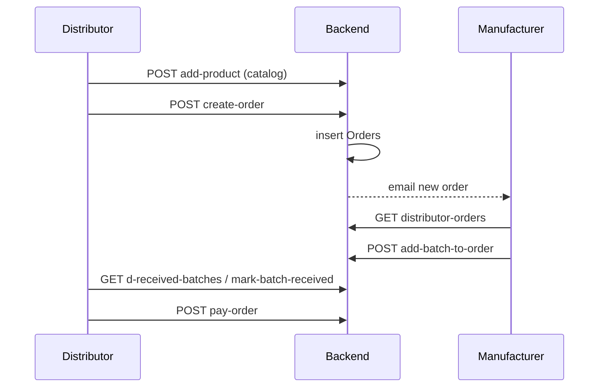
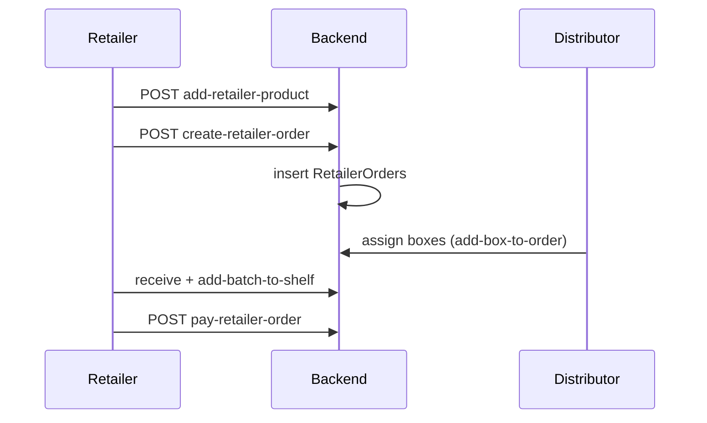
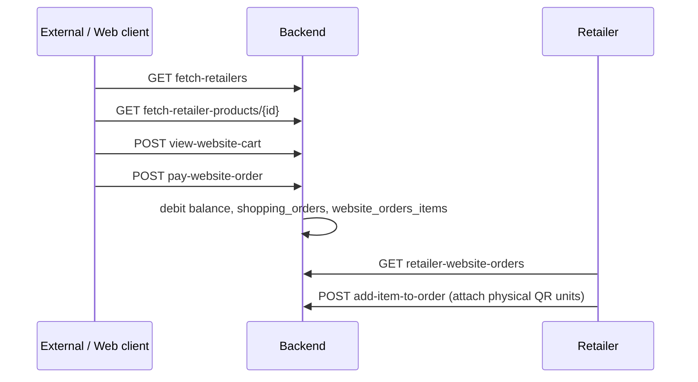
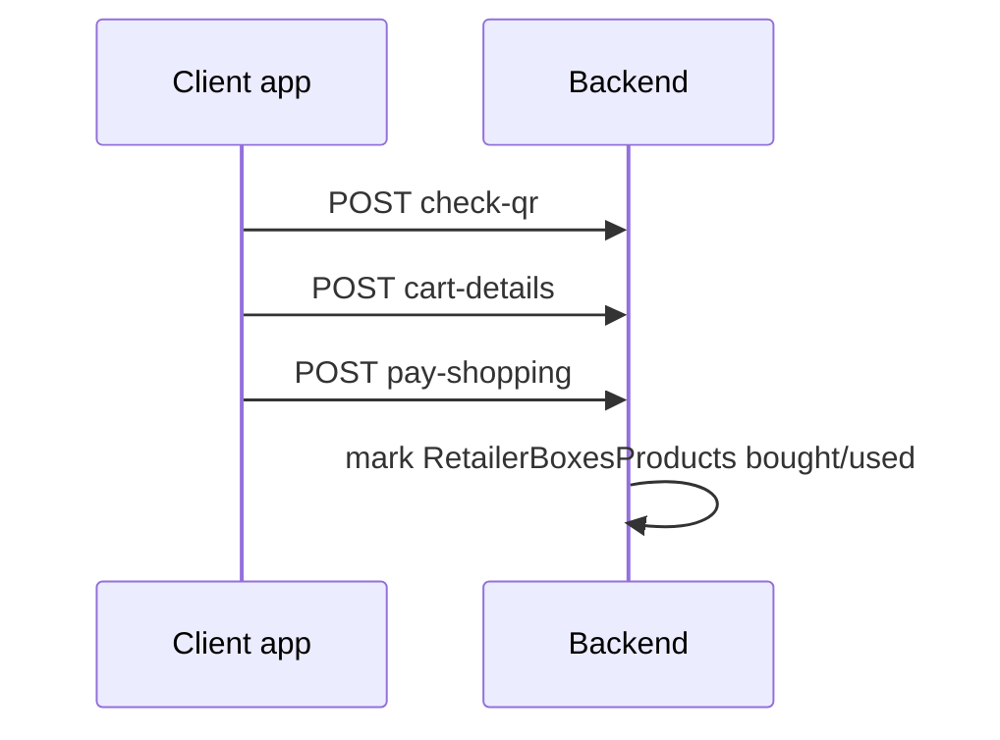

# Very Pro — Buy / Sell Flows & Client Shopping APIs

This document explains how purchasing, buying, and selling work across the app, and which **existing API paths** other client apps can reuse to list products and shop.

Base URL (local): `http://127.0.0.1:8000/api/`

---

## 1. Roles in the supply chain

| Role | Account type | What they sell | Who they buy from |
|------|--------------|----------------|-------------------|
| **Manufacturer** | `Manufacturer` | Own products (`Products`) | N/A (produces stock) |
| **Distributor** | `Distributor` | Catalog in `DistributorProducts` | Manufacturers |
| **Retailer** | `Retailer` | Catalog in `RetailerProducts` + shelf units (`RetailerBoxesProducts`) | Manufacturers and/or Distributors |
| **Personal / Client** | `Users.userType` personal (`0`) | N/A | Retailers (end customers) |

Business shops live in `Accounts` (linked to a `Users` row via `userId`).  
Products originate in `Products` (owned by a manufacturer `ownerId`).

```
Manufacturer ──orders──► Distributor ──orders──► Retailer ──sales──► Client
     │                        │                      │
  Products              DistributorProducts    RetailerProducts
  stock / batches       assigned_batches       RetailerBoxesProducts
```

---

## 2. High-level commerce model

There are **three separate commerce paths**:

1. **B2B: Distributor/Retailer → Manufacturer** — table `Orders`
2. **B2B: Retailer → Distributor** — table `RetailerOrders`
3. **B2C: Client → Retailer** — two variants:
   - **QR scan shop** (physical unit codes) — `pay-shopping`
   - **Website / catalog shop** (product IDs) — `pay-website-order`

Wallet balance on `Users.balance` is used for payments in all paths.

---

## 3. Manufacturer flow

Manufacturers **do not place purchase orders upstream**. They produce, stock, batch, and fulfill inbound B2B orders.

### 3.1 Setup

| Step | Action | API |
|------|--------|-----|
| 1 | Create shop (`Accounts`) | `POST create-shop` |
| 2 | Add product | `POST new-product` |
| 3 | List / edit products | `GET business-products/{business_id}`, `GET product-details/{id}`, `POST edit-product` |
| 4 | Add units to stock | `POST update-stock` |
| 5 | View stock history | `GET stock-history/{product_id}/{business_id}` |
| 6 | Create batch (boxes + product QR codes from unused stock) | `POST new-batch` |
| 7 | List batches | `GET business-batches/{business_id}` |

### 3.2 Fulfill orders from distributors/retailers

| Step | Action | API |
|------|--------|-----|
| 1 | See inbound purchase orders | `GET distributor-orders/{business_id}` |
| 2 | Order details | `POST distributor-order-details` |
| 3 | List unassigned batches for a product | `GET batches-to-assigned/{business_id}/{product_id}` |
| 4 | Assign batch to order | `POST add-batch-to-order` |
| 5 | Change status / delete | `POST change-order-status`, `POST delete-order` |
| 6 | Inventory view | `GET manufacturer-inventory/{business_id}` |

**Important:** Manufacturers receive orders; they do not “order from” anyone in this app.

---

## 4. Distributor flow

### 4.1 Catalog setup (required before ordering)

Distributors must register manufacturer products into their catalog first:

| Step | Action | API |
|------|--------|-----|
| 1 | Browse all manufacturer products | `GET get-products-to-add` |
| 2 | Add product to distributor catalog | `POST add-product` → `DistributorProducts` |
| 3 | List own catalog | `GET d-products/{business_id}` |
| 4 | Edit selling price / reorder | `GET d-product-details/{id}`, `POST edit-d-product` |

### 4.2 Order from manufacturer

| Step | Action | API |
|------|--------|-----|
| 1 | Manage suppliers | `GET get-suppliers`, `POST new-supplier`, `GET my-suppliers/{business_id}` |
| 2 | Load supplier’s products | `GET supplier-products/{supplier_id}` |
| 3 | Create order | `POST create-order` → inserts `Orders` |
| 4 | Track outgoing orders | `GET outgoing-orders/{business_id}` |
| 5 | Pay manufacturer | `POST pay-order` |

`create-order` rejects the order if the product is **not** in `DistributorProducts` for that business.

### 4.3 Receive & hold inventory

| Step | Action | API |
|------|--------|-----|
| 1 | Received batches | `GET d-received-batches/{business_id}` |
| 2 | Mark batch received | `POST mark-batch-received` |
| 3 | Scan batch / box | `POST scan-batch`, `POST scan-box` |
| 4 | Inventory | `GET distributor-inventory/{business_id}` |

### 4.4 Sell to retailers

| Step | Action | API |
|------|--------|-----|
| 1 | Orders from retailers | `GET retailer-orders/{business_id}` |
| 2 | Assign boxes to retailer order | `GET boxes-to-assign/...`, `POST add-box-to-order` |
| 3 | Change retailer order status | `POST change-retailer-order-status` |

---

## 5. Retailer flow

### 5.1 Catalog setup (required before ordering / website selling)

| Step | Action | API |
|------|--------|-----|
| 1 | Browse all products | `GET get-products-to-add` |
| 2 | Add to retailer catalog | `POST add-retailer-product` → `RetailerProducts` |
| 3 | List catalog | `GET r-products/{business_id}` |
| 4 | Edit price | `GET r-product-details/{id}`, `POST edit-r-product` |

### 5.2 Order from manufacturer

Same as distributor B2B path: `POST create-order` (requires product in `RetailerProducts`), then `GET outgoing-orders/{business_id}`, `POST pay-order`.

### 5.3 Order from distributor

| Step | Action | API |
|------|--------|-----|
| 1 | Distributor catalog for supplier | `GET d-supplier-products/{supplier_id}` |
| 2 | Create retailer→distributor order | `POST create-retailer-order` → `RetailerOrders` |
| 3 | Outgoing to distributors | `GET retailer-outgoing-orders/{business_id}` |
| 4 | Pay distributor | `POST pay-retailer-order` |

### 5.4 Receive stock onto shelf (QR units for QR shopping)

| Step | Action | API |
|------|--------|-----|
| 1 | Received batches | `GET received-batches/{business_id}` |
| 2 | Put batch on shelf (creates `RetailerBoxes` + `RetailerBoxesProducts`) | `POST add-batch-to-shelf` |
| 3 | Check if batch already shelved | `GET check-batch/{batch_code}` |
| 4 | Inventory | `GET retailer-inventory/{business_id}` |

### 5.5 Sell to clients

| Channel | How | APIs |
|---------|-----|------|
| In-store QR | Client scans product QR | See §6.1 |
| Website catalog | Client browses retailer products | See §6.2 |
| Sales history | Retailer dashboard | `GET retailer-sales/{business_id}` |
| Website orders | Retailer dashboard | `GET retailer-website-orders/{business_id}` |

---

## 6. Client (end customer) shopping flows

### 6.1 QR scan shopping (`/shop`)

Used when a physical product QR (`RetailerBoxesProducts.productQrCode`) is scanned.

```
Scan QR → check-qr → cart (QR codes) → cart-details → pay-shopping
                                                      ↓
                              debit Users.balance
                              mark units bought/used
                              shopping_orders + orderPayments
```

| Step | Method | Path | Body / params |
|------|--------|------|---------------|
| Validate unit | POST | `check-qr` | `{ qr }` — must exist and `bought = No` |
| Resolve cart lines | POST | `cart-details` | `{ cart: [qr, ...] }` |
| Pay | POST | `pay-shopping` | `{ user_id, cart: [qr, ...] }` |
| Buyer order history | GET | `my-shopping-orders/{buyer}` | — |

**Returns from pay:** `success` or `fail` (insufficient balance).

### 6.2 Website / catalog shopping (browse retailers)

This is the path best suited for **other apps** that want clients to see products and buy without scanning.

```
fetch-retailers → fetch-retailer-products/{id} → product_cart (productIds)
       → view-website-cart → pay-website-order
                              ↓
                   shopping_orders (website_order=1)
                   website_orders_items
                   orderPayments
```

| Step | Method | Path | Notes |
|------|--------|------|-------|
| List retailers | GET | `fetch-retailers` | All `Accounts` with `accountType = Retailer` |
| Search businesses | POST | `search-business` | `{ search_text }` |
| **List products for a retailer** | GET | `fetch-retailer-products/{business_id}` | Name, price, image, description, product `id` |
| Preview cart | POST | `view-website-cart` | `{ cart: [productId, ...] }` from `RetailerProducts` |
| Checkout | POST | `pay-website-order` | `{ user_id, cart: [productId, ...] }` |
| Buyer history | GET | `my-shopping-orders/{buyer}` | — |
| Retailer: website order detail | GET | `website-order-details/{order_id}/{business_id}` | — |
| Retailer: fulfill by scanning unit onto order | POST | `add-item-to-order` | `{ qr, retailer, buyer, order_id }` |
| Retailer: cancel website order | POST | `delete-website-order` | `{ order_id }` |

**Auth note:** These routes are currently **unauthenticated** (no Sanctum middleware on most business/shop APIs). External apps should still send a valid `user_id` for payment, typically after `POST login` / `POST user-details`.

---

## 7. Existing APIs useful for external “shop as client” apps

### Recommended minimal client integration

| Purpose | Endpoint | Ready for external apps? |
|---------|----------|--------------------------|
| Register / login | `POST register`, `POST login`, `POST check-email` | Yes |
| User profile / balance | `POST user-details` | Yes |
| **Global products feed** | `GET products-feed?audience=client\|business` | **Yes — BeautyExpress embed** |
| List all retailers | `GET fetch-retailers` | **Yes — catalog entry point** |
| Search retailers | `POST search-business` | Yes |
| **Products to shop (per retailer)** | `GET fetch-retailer-products/{business_id}` | **Yes — primary product list** |
| Cart preview | `POST view-website-cart` | Yes |
| Pay | `POST pay-website-order` | Yes |
| My orders | `GET my-shopping-orders/{buyer}` | Yes |

### Related browse APIs (not end-customer shelf, but useful)

| Purpose | Endpoint |
|---------|----------|
| All manufacturer products (raw catalog) | `GET get-products-to-add` |
| Manufacturer’s products | `GET fetch-manufacturer-products/{business_id}` |
| Distributor’s products | `GET fetch-distributor-products/{business_id}` |
| List manufacturers / distributors | `GET fetch-manufacturers`, `GET fetch-distributors` |
| Product categories | `GET product-categories` |
| Single product (manufacturer record) | `GET product-details/{product_id}` |

### QR client path (in-store / mobile scan apps)

| Purpose | Endpoint |
|---------|----------|
| Validate QR | `POST check-qr` |
| Cart by QR | `POST cart-details` |
| Pay scanned items | `POST pay-shopping` |

### Gaps for a polished external shop app

`GET /api/products-feed` now provides a cross-retailer (client) and manufacturer (business) feed for embeddable UIs such as BeautyExpress.

Still useful to add later for a full marketplace:

- Pagination / filters
- Guest checkout
- Stock availability on website cart (website checkout sells by `productId`, not by reserved QR unit; retailer fulfills later via `add-item-to-order`)
- Auth tokens / rate limiting on shop routes

---

## BeautyExpress (`beauty-main`) integration

BeautyExpress embeds the Very Pro feed below page content:

- Client dashboard → `audience=client`
- Salon admin dashboard → `audience=business`
- Landing page → `audience=client`

Proxy: `GET /api/verypro/products` in beauty-main  
Toggle: “Show product feed” (stored in `localStorage` as `verypro_feed_enabled`)  
Env: `VERYPRO_API_URL`, `NEXT_PUBLIC_VERYPRO_SHOP_URL`, `NEXT_PUBLIC_VERYPRO_FEED_ENABLED`

## 8. End-to-end sequence diagrams

### 8.1 Distributor buys from manufacturer



### 8.2 Retailer buys from distributor



### 8.3 Client shops via website catalog (best for other apps)



### 8.4 Client shops via QR scan



---

## 9. Key tables (commerce)

| Table | Role |
|-------|------|
| `Products` | Master product (manufacturer-owned) |
| `DistributorProducts` | Distributor sellable catalog |
| `RetailerProducts` | Retailer sellable catalog (website shop uses this) |
| `Orders` | B2B orders to manufacturers |
| `RetailerOrders` | Retailer → distributor orders |
| `BatchProductDeals` / `Boxes` / `BoxProducts` | Manufacturer batch + QR hierarchy |
| `assigned_batches` | Batch assigned to a B2B order |
| `RetailerBoxes` / `RetailerBoxesProducts` | Retailer shelf units (QR shop) |
| `shopping_orders` | Client purchases |
| `website_orders_items` | Line items for website orders |
| `orderPayments` | Payment ledger |
| `Users.balance` | Wallet used for all payments |

---

## 10. Practical answer: can other apps list products for clients today?

**Yes.** Prefer the aggregated feed:

1. `GET /api/products-feed?audience=client` — all retailer products in one call  
2. Or per shop: `GET /api/fetch-retailers` then `GET /api/fetch-retailer-products/{business_id}`  
3. Checkout remains `POST /api/view-website-cart` + `POST /api/pay-website-order`

For businesses/supply: `GET /api/products-feed?audience=business`  
For in-store / scan apps: `check-qr` → `cart-details` → `pay-shopping`
